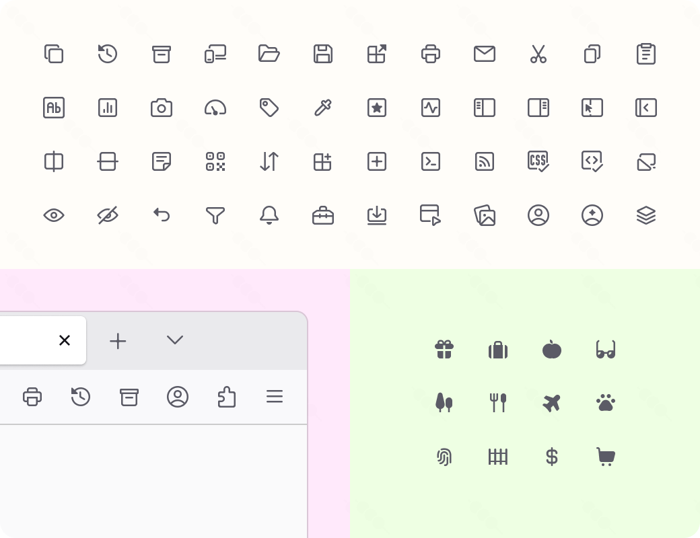

<div align="center">


# Dango

A delightful supplemental icon library for Firefox Proton 🍡

</div>

## Why?

Some Firefox icons either have not been updated with newer versions or do not align well with the aesthetics of their design system [Acorn](https://acorn.firefox.com/). When they do, I find that few of their icons miss the mark.

**Dango** aims to bridge this gap by providing custom user-created icons that seamlessly complement Firefox's user interface.

All icons are designed in a 16x16 grid, with a 1.25px stroke and mostly 2px stroke rounding. In addition, extra icons are provided for use in Firefox forks and mods providing extra functionality.

> [!NOTE]
> While Dango try its best to follow the style of Firefox icons as close as possible, there will always be imperfections and some icons even ignore following the style altogether.

All that aside, I only made this as a fun exercise in icon design ^^

## Usage

### Standalone SVGs

All SVG icons inside the `svg` directory include the necessary SVG attributes and have been optimized, making them ready to use in your CSS theme or personal projects. You can easily drop and link them in your `userChrome.css`.

### Single CSS file

The `css/dango-icons.css` file includes all Dango icons stored as root variables in data URI format. Import this CSS file in your `userChrome.css` and use its variables anywhere.

```css
@import "dango-icons.css";

/* Replace sidebar and save page icons in Firefox */
#sidebar-button {
  list-style-image: var(--dango-sidebar-left) !important;
}
#save-page-button {
  list-style-image: var(--dango-save) !important;
}
```

## Preview



## Acknowledgements

### Acorn

Dango is primarily inspired by [Acorn Icons](https://github.com/FirefoxUX/acorn-icons), which is licensed under the MPL 2.0.

Some Dango icons are derivative works, remixed from the Acorn Icons collection.

### Parfait

Dango has been extracted from [Parfait](https://github.com/reizumii/parfait), which is licensed under the MPL 2.0.

## License

Dango is licensed under the [MPL 2.0](https://github.com/reizumii/dango/blob/main/LICENSE).
